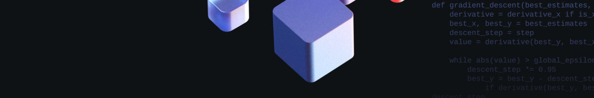

# Flask проект для МТС ШАД



## Краткое описание

Проект посвящен созданию веб-приложения в Docker-контейнере для использования предварительно обученной модели Машинного обучения.
Работа включала интеграцию ML-модели с фреймворком Flask, оформление HTML-страниц, и упаковку результата в Docker-контейнер.

## Технологический стек

- `Python 3.11`.
- `Flask 2.3.2` в основе веб-приложения.
- `CatBoost 1.2.3` в роли ML-модели.
- `NumPy 1.26.4`, `Pandas 2.2.2` для обработки данных.
- `Matplotlib 3.7.0`, `Seaborn 0.12.2` для визуализации данных.

## Установка и запуск

1. Клонируйте репозиторий:
   ```bash
   git clone https://github.com/reekuu/flask_project_mts_shad.git
   cd flask_project_mts_shad
   ```
2. Установите зависимости:
   ```bash
   pip install -r requirements.txt
   ```

3. Запустите веб-сервер:
   ```bash
   cd app
   flask run --host=0.0.0.0 --port=3001
   ```

## Docker-контейнер

## Пример использования
Для использования перейдите по адресу `http://localhost:3000` после запуска сервера. Веб-интерфейс предоставит форму для загрузки датасета и покажет результаты моделирования.
